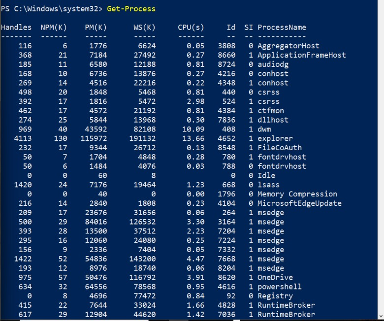
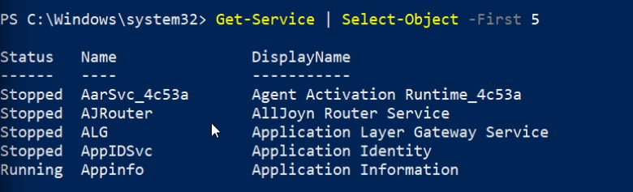
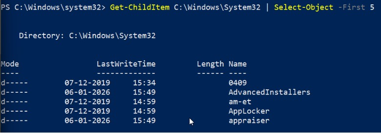
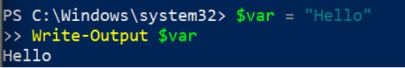
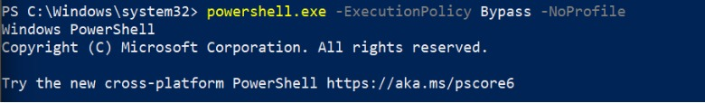
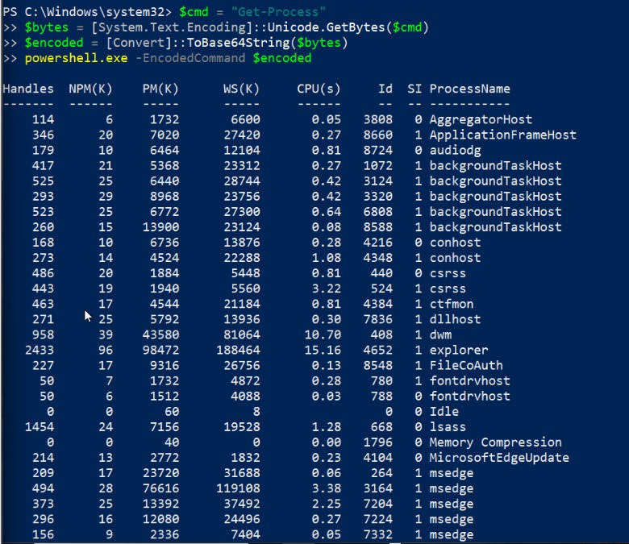
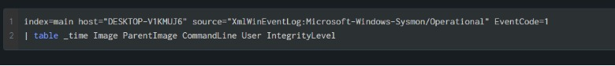
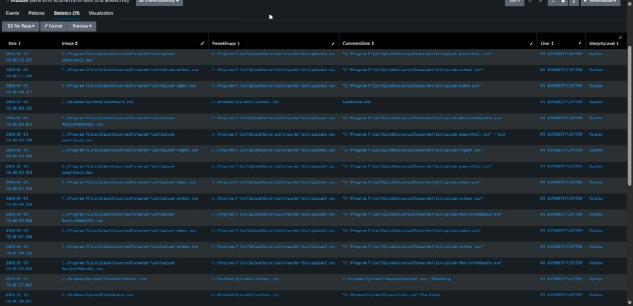
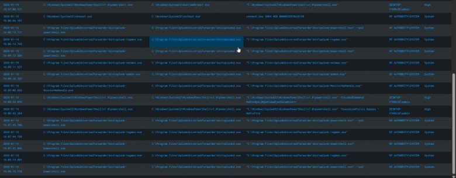

--------Command Used to Generate PowerShell Telemetry-------------------------

This section documents the PowerShell commands executed on the Windows VM to generate normal and suspicious process creation events (Sysmon Event ID 1) for analysis in Splunk.
Normal PowerShell Activity:

1-

```powershell
Get-Process
```


This command was executed to represent legitimate interactive PowerShell usage, commonly performed by administrators to view running processes on a system.

2-
```powershell
Get-Service | Select-Object -First 5
```


This command was used to simulate routine system inspection tasks, such as checking service status, which administrators frequently perform using PowerShell.

3-
```powershell
Get-ChildItem C:\Windows\System32 | Select-Object -First 5
```


This command was executed to simulate filesystem enumeration using PowerShell, specifically targeting the C:\Windows\System32 directory, which contains critical system binaries and libraries.

4-
```powershell
$var = "Hello"
Write-Output $var
```


This command demonstrates basic PowerShell variable assignment and output, which is commonly used in scripts, testing, automation.

5-

```powershell
powershell.exe -ExecutionPolicy Bypass -NoProfile
```


This command launches a new PowerShell process while skipping user profile loading, bypassing PowerShell execution policy restrictions. It was executed to simulate modified PowerShell execution behavior that is commonly abused. This is high-risk PowerShell behavior and a strong detection signal.

6-
```powershell
$cmd = "Get-Process"
$bytes = [System.Text.Encoding]::Unicode.GetBytes($cmd)
$encoded = [Convert]::ToBase64String($bytes)
powershell.exe -EncodedCommand $encoded
```


This sequence encodes a PowerShell command in Base64 and executes it using the -EncodedCommand flag to obscure the actual command.
It was executed to simulate obfuscated PowerShell execution, a very common attacker technique.
Even though the decoded command (Get-Process) is benign, the execution method makes this a strong malicious indicator.


----------------Splunk Command--------------------
```splunk
index=main host="DESKTOP-V1KMUJ6" source="XmlWinEventLog:Microsoft-Windows-Sysmon/Operational" EventCode=1
| table _time Image ParentImage CommandLine User IntegrityLevel
```


This query retrieves Sysmon Event ID 1 (Process Creation) events from the specified Windows host and presents the most relevant fields needed to analyze PowerShell execution behavior.


--------OUTPUT Explanation---------




The majority of the observed process creation events represent normal system and service-driven activity. Multiple PowerShell executions are initiated by the Splunk Universal Forwarder binaries such as splunk-powershell.exe, splunk-regmon.exe, and splunk-netmon.exe, all running under the NT AUTHORITY\SYSTEM account with System integrity level. These processes are expected as part of Splunk’s internal monitoring and data collection operations. Additional system processes like taskhostw.exe, usoclient.exe, and svchost.exe are also present and indicate routine Windows background activity. The absence of suspicious PowerShell flags such as encoded commands or execution policy bypass confirms that these events form part of normal baseline noise rather than malicious behavior.


One of the observed PowerShell executions includes the -EncodedCommand parameter and runs under the interactive user account DESKTOP-V1KMUJ6\admin with a High integrity level. The use of Base64-encoded commands is a well-known obfuscation technique designed to hide the true intent of execution from logs and analysts. Although the decoded command in this case is benign, the execution method itself is highly suspicious because encoded PowerShell commands are commonly used in malware delivery and post-exploitation frameworks.

Another suspicious event involves PowerShell being launched with both -ExecutionPolicy Bypass and -NoProfile parameters under the same administrative user and high integrity context. This execution explicitly disables PowerShell’s built-in script execution restrictions and avoids loading user profiles, reducing execution artifacts. Such behavior is rarely required in standard administrative workflows and is strongly associated with attacker tradecraft used to execute unsigned or malicious scripts.

A third notable event shows an interactive PowerShell session running with High integrity under the administrative user account without being spawned by a system service. While elevated PowerShell sessions can be legitimate, their presence alongside encoded and execution policy bypassed commands significantly increases suspicion. In a SOC environment, this would be treated as corroborating evidence within a broader attack chain rather than an isolated benign event.

This analysis demonstrates how PowerShell abuse is identified not by its presence alone, but by execution context, integrity level, user account, and command-line behavior. Differentiating baseline system noise from high-risk PowerShell execution patterns is critical for effective endpoint detection engineering.


